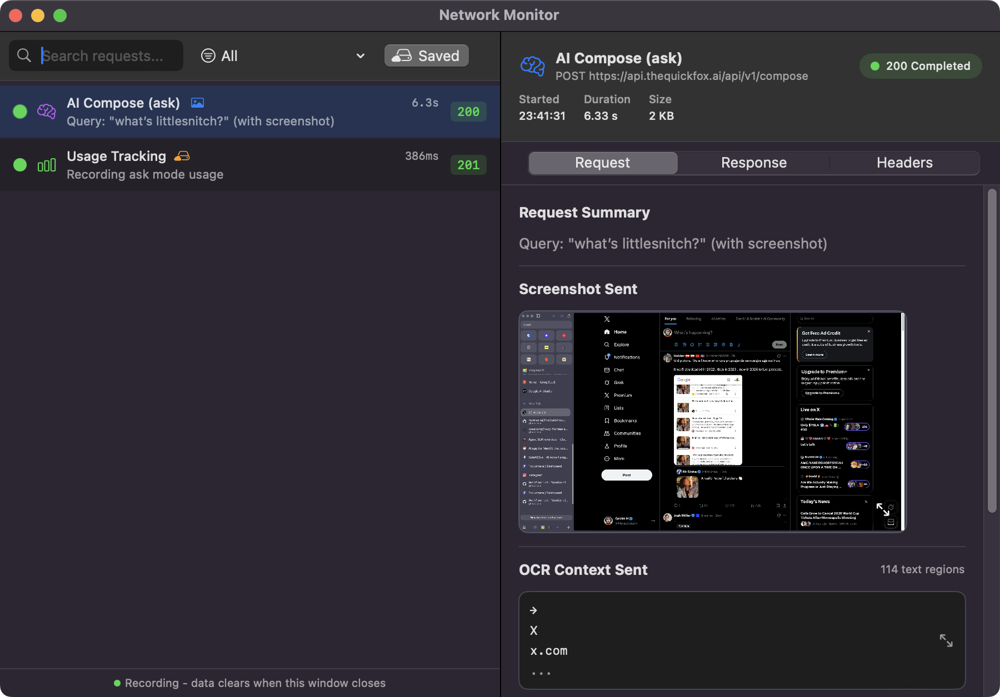

# TheQuickFox

This is the source code for TheQuickFox, a macOS app that provides AI-powered assistance with full context awareness of your screen.

[Watch the demo video](https://vimeo.com/1153004023)

### How it works

Type what you want to say in the HUD:


Press Enter, and TheQuickFox rewrites it with full context awareness and inserts the response:


## Why Open Source?

This code is open-sourced for **transparency and trust**. We want you to see exactly what the app does, what data it collects, and how it communicates with our servers.

The app requires TheQuickFox backend API to function. This source code allows you to:
- Audit the code for security and privacy
- Understand exactly what data is sent to our servers
- Verify our privacy claims
- Build and run a local version for testing

## Privacy & Transparency

We take your privacy seriously. **We do not store your screenshots or screen content.** Screenshots and OCR text are sent to our API for AI processing and immediately discarded—they are never saved to disk or database.

To help you verify this claim (and not just take our word for it), we've built a **Network Monitor** directly into the app and open-sourced the client code.

### Network Monitor

The Network Monitor (accessible from the app's menu) lets you see exactly what data is sent to our servers in real-time.


Every request is logged with its category, response time, and status code. The **cloud icon** (visible on "Usage Tracking" above) indicates when data is stored on our servers. Requests without this icon are processed and discarded.

Click any request to see the full details—including the exact screenshot and OCR text that was sent:



The detail view shows you:
- **Request Summary** — What the request is doing
- **Screenshot Sent** — The actual screenshot sent to the API (if any)
- **OCR Context Sent** — The text extracted from your screen
- **Response/Headers tabs** — Full request and response data

Notice that AI Compose requests show no cloud icon—your screenshots and screen content are processed but **never stored**.

### What Data Is Stored vs. Processed

| Request Type | Stored on Server | What's Saved |
|--------------|------------------|--------------|
| AI Compose | No | Nothing—screenshot and OCR processed, then discarded |
| Device Registration | Yes | Device UUID and name (to identify your device) |
| Usage Tracking | Yes | Query mode, app name, timestamp (for usage limits) |
| Bug Reports | Yes | Your message and system info (only when you submit) |
| Billing | No | Handled by Stripe, not our servers |

### How to Audit the Client

Since the client is open source, you can verify our privacy claims yourself:

1. **Search for API calls** — All network requests go through `macos/Sources/TheQuickFox/API/`. Check `APIClient.swift` and `ComposeClient.swift` to see exactly what data is sent.

2. **Check the Network Monitor source** — See `macos/Sources/TheQuickFox/NetworkMonitor/NetworkMonitor.swift` for how we categorize requests and mark what's saved. Look for `isSavedOnServer: false` on AI Compose requests (line 346).

3. **Run with Network Monitor open** — Use the app normally with Network Monitor open. Every API call appears in real-time. Click any request to inspect the full payload.

4. **Use a proxy** — For additional verification, run the app through Charles Proxy or mitmproxy to independently capture all traffic.

5. **Build from source** — Build the app yourself to ensure the binary matches the source code.

For our full privacy policy and data practices, visit the [Privacy Center](https://www.thequickfox.ai/privacy-center/).

## Building from Source

### Requirements

- macOS 13.0 or later
- Xcode 15.0 or later
- Swift 5.9 or later

### Build Instructions

1. Clone the repository:
   ```bash
   git clone https://github.com/foxwiseai/thequickfox.git
   cd thequickfox
   ```

2. Build the app:
   ```bash
   # Debug build (current architecture)
   ./scripts/build-app.sh debug

   # Release build (current architecture)
   ./scripts/build-app.sh release

   # Universal build (Intel + Apple Silicon)
   ./scripts/build-app.sh release --universal
   ```

3. The built app will be at:
   ```
   macos/.build/release/TheQuickFox.app
   ```

4. To run directly with Swift:
   ```bash
   cd macos
   swift run TheQuickFox
   ```

### Code Signing

By default, builds are ad-hoc signed. For proper distribution, configure your signing identity in `scripts/.util/codesign-config.sh`.

## Project Structure

```
macos/
├── Sources/
│   ├── TheQuickFox/           # Main app
│   │   ├── API/               # Backend API clients
│   │   ├── Architecture/      # State management (Redux-like)
│   │   ├── HUD/               # Heads-up display UI
│   │   ├── NetworkMonitor/    # Transparency tool
│   │   ├── Onboarding/        # First-run experience
│   │   └── ...
│   ├── TheQuickFoxCore/       # Core library (OCR, text recognition)
│   └── OCRCli/                # CLI tool for OCR testing
├── Resources/                 # Icons, assets
├── Package.swift              # Swift package manifest
└── Info.plist                 # App configuration
```

## License

This project is licensed under the [Polyform Shield License 1.0.0](https://polyformproject.org/licenses/shield/1.0.0/).

In short: You can view, use, modify, and distribute this code freely—but you cannot use it to build a product that competes with TheQuickFox.

See [LICENSE](LICENSE) for the full text.

## Links

- [TheQuickFox Website](https://www.thequickfox.ai)
- [Privacy Center](https://www.thequickfox.ai/privacy-center/)
- [Terms of Service](https://www.thequickfox.ai/terms.html)
