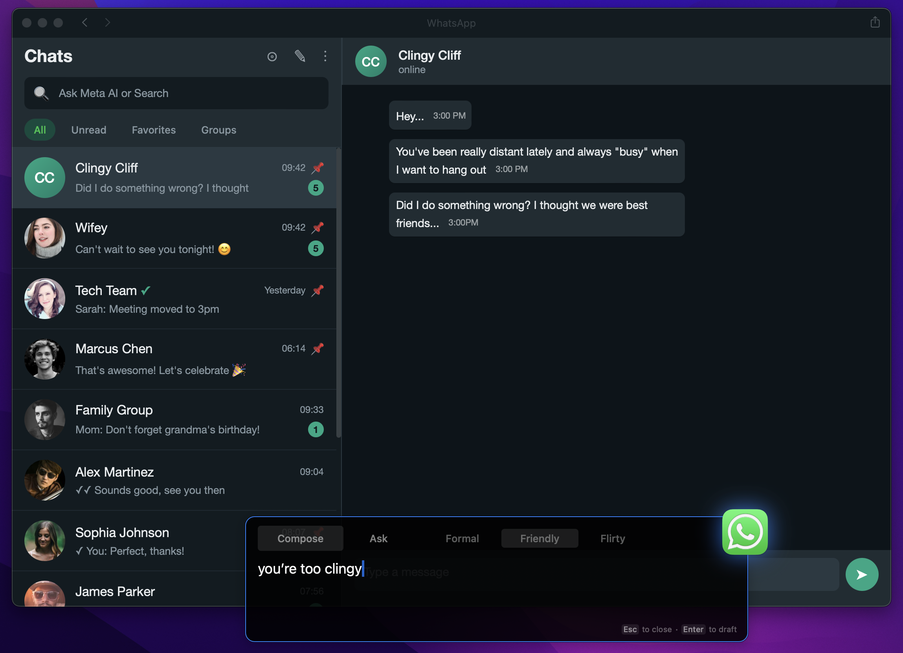
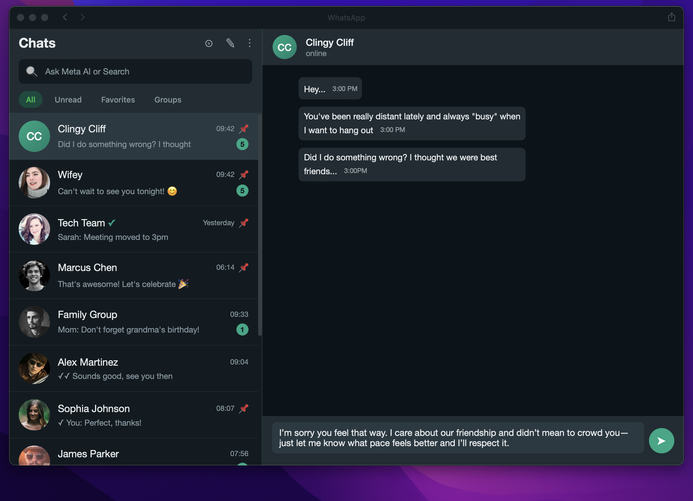

# TheQuickFox

A macOS app that provides AI-powered assistance with full context awareness of your screen.

[Watch the demo video](https://vimeo.com/1153004023)

### How it works

Type what you want to say in the HUD:



Press Enter, and TheQuickFox rewrites it with full context awareness and inserts the response:



## Self-Hosting

Run the entire stack locally. Your data never leaves your machine—just direct calls to AI providers (Groq, Gemini) with your own API keys.

### Requirements

- macOS 13.0+
- Docker
- API keys:

| Key | Get it at |
|-----|-----------|
| `GROQ_API_KEY` | https://console.groq.com/keys |
| `GEMINI_API_KEY` | https://aistudio.google.com/apikey |

### Setup & Run

```bash
git clone https://github.com/foxwiseai/thequickfox.git
cd thequickfox

# Configure API keys
cp api/.env.example api/.env
# Edit api/.env and add your keys

# Terminal 1: Start the API
cd api && docker compose up
# Wait for: "Access TqfApiWeb.Endpoint at http://localhost:4003"

# Terminal 2: Build and run the macOS app
./scripts/build-app.sh --local
open macos/.build/release/TheQuickFox.app
```

## Project Structure

```
macos/                      # macOS client (Swift)
├── Sources/TheQuickFox/    # Main app
├── Sources/TheQuickFoxCore # Core library (OCR, text recognition)
└── Package.swift

api/                        # Backend API (Elixir/Phoenix)
├── lib/tqf_api/            # Business logic
├── lib/tqf_api_web/        # HTTP endpoints
└── docker-compose.yml
```

## License

[Polyform Shield License 1.0.0](https://polyformproject.org/licenses/shield/1.0.0/) — use, modify, and distribute freely, but not to compete with TheQuickFox.
